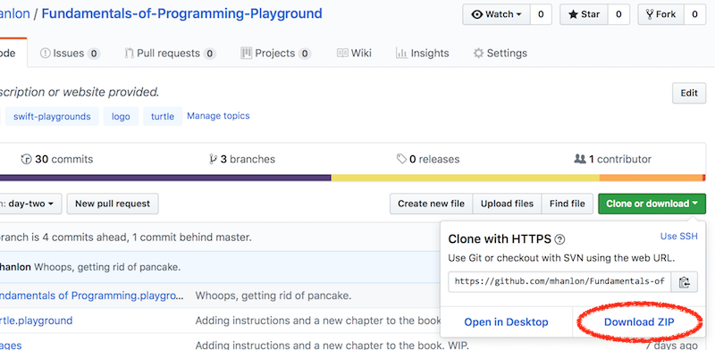
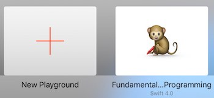

# Fundamentals of Programming.playground Read Me

This playground is meant for teaching the fundamentals of computer programming using a Logo-like approach. The idea, especially for the first chapter, is to strip away as much noise as possible and give the student simple commands to tell the machine what to do. 

You can clone this repo to your local machine and then Airdrop the playgroundbook onto your iPad with Swift Playgrounds.

It's intended to be used with my course, Fundamentals of Programming, but I *think* you could probably follow along at home without me blabbering at you.

You can download a little helper for degrees and a Logo command reference from http://www.wickedpearprogramming.com/w/resources/, but, since the Logo commands I've implemented in Swift are a little different you're probably better off referring to the help and hints in the playground book.

## Installation
First, download this repository as a zip file.

Depending on your settings, you may need to double-click the resulting zip file in your Downloads folder, which should result in something that looks like this (note: there may be additional playgrounds in the downloaded folder, depending on the state of the repository at the time):

Select the playground book by clicking on the Fundamentals of Programming.playgroundbook. From the sharing menu item in the toolbar of your Finder window choose AirDrop (this step assumes that your iPad and your Mac are on the same WiFi network).

You'll see a list of machines to which you can AirDrop this playground book. Select the iPad where you want to run this playground

You'll see an acceptance dialog on that iPad.

Tap Accept and, if you have Swift Playgrounds installed, the playground book will be added to your list of playgrounds.

